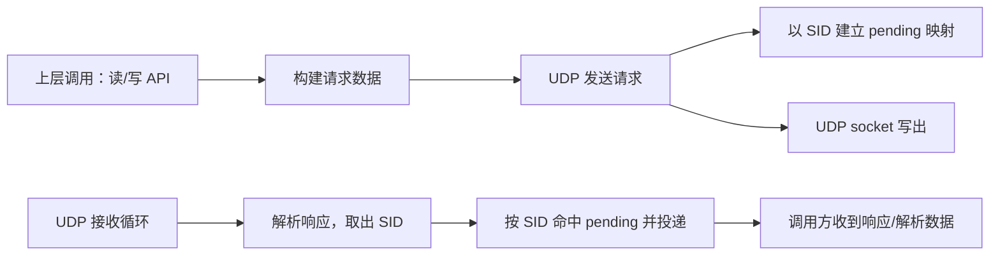
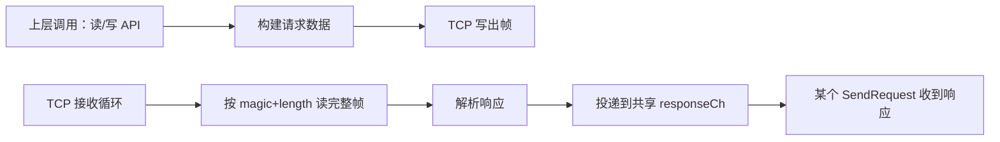

# 项目介绍：欧姆龙 FINS UDP + TCP 协议库（Go）

> 面向后续重构/维护开发者：解释当前库的分层、关键数据结构、请求/响应流转、典型调用链，并列出可直接落地的短期修复项（含文件/函数/行号定位）。

## 1. 项目定位与能力边界

- 这是一个欧姆龙 PLC FINS 协议的 Go 实现，支持两种传输承载：
  - UDP：基于 FINS/UDP 帧头（10B）+ command(2B) + 数据区。
  - TCP：基于库内定义的 FINS/TCP 帧头（魔数 + 长度 + 节点号等）。
- 当前对外提供的主要应用层能力：
  - 内存区读写（字/位）与字节数组读写（按字对齐）。
  - 连接统计（请求数/成功/错误/超时/时间戳）。
  - 包装器：重试、自动重连。

对外文档入口：[`README.md`](../README.md:1)、[`docs/API_REFERENCE.md`](API_REFERENCE.md:1)、协议说明：[`docs/FINS_PROTOCOL_SPEC.md`](FINS_PROTOCOL_SPEC.md:1)。

## 2. 分层与模块职责（“怎么拆、哪里改”）

### 2.1 分层概览

- 高层 API（面向用户/业务）
  - 统一客户端类型：[`type FinsClient`](../client.go:16)
  - 内存区读写便捷方法：例如 [`(*FinsClient).ReadMemoryArea()`](../client.go:54)、[`(*FinsClient).WriteMemoryArea()`](../client.go:72)、[`(*FinsClient).ReadBit()`](../client.go:98)
- 传输层抽象（可替换 UDP/TCP）
  - 传输接口：[`type Client`](../client.go:8)
  - UDP 实现：[`type FinsUDPClient`](../udp_client.go:11)
  - TCP 实现：[`type FinsTCPClient`](../tcp_client.go:12)
- 帧与编解码（协议格式）
  - UDP 帧构建/解析：[`BuildUDPFrame()`](../udp_frame.go:10)、[`ParseUDPResponse()`](../udp_frame.go:88)
  - TCP 帧构建/解析：[`BuildTCPFrame()`](../tcp_frame.go:10)、[`ReadTCPFrameFromConn()`](../tcp_frame.go:135)、[`ParseTCPResponse()`](../tcp_frame.go:108)
  - FINS 读写请求数据构建：[`BuildReadMemoryRequest()`](../udp_frame.go:114)、[`BuildWriteMemoryRequest()`](../udp_frame.go:124)
- 可靠性与韧性（横切关注点）
  - 重试包装器：[`type RetryableClient`](../retry.go:65)
  - 自动重连包装器：[`type ReconnectableClient`](../reconnect.go:34)
- 常量/类型
  - 配置：[`type FinsClientConfig`](../types.go:21)
  - 常量：[`constants.go`](../constants.go:1)
  - 数据结构：[`types.go`](../types.go:1)

### 2.2 模块边界建议（为短期修复服务）

当前代码结构已经比较清晰，短期修复建议遵循“最小侵入”：

- 在传输实现层（[`udp_client.go`](../udp_client.go:1)、[`tcp_client.go`](../tcp_client.go:1)）修复并发/数据竞争/匹配问题。
- 在包装器层（[`retry.go`](../retry.go:1)、[`reconnect.go`](../reconnect.go:1)）修复可重入性、错误识别与可观测性。
- 在 types/config 层（[`types.go`](../types.go:1)）修复未落地字段的误导。

## 3. 关键数据结构与协议字段映射

### 3.1 配置

- 配置结构：[`type FinsClientConfig`](../types.go:21)
  - 关键字段：
    - IP/Port：目标 PLC 的网络地址（默认端口见 [`DefaultPort`](../constants.go:6)）。
    - LocalNode/ServerNode：FINS 节点号（UDP 帧中写入 SA1/DA1；TCP 帧中写入 ClientNode/ServerNode）。
    - Timeout：请求等待响应的超时时间（UDP/TCP 均通过 `time.After` 实现）。
    - SIDMode/FixedSID/StartSID/MaxSID：仅 UDP 用于请求-响应匹配。
  - 注意：[`FinsClientConfig.RetryCount`](../types.go:27) 与 [`FinsClientConfig.EnableAutoNode`](../types.go:32) 在当前实现中未被使用（见“风险/债务”章节）。

### 3.2 帧结构

- UDP 帧结构体：[`type FinsUDPFrame`](../types.go:53)
  - 帧构建：[`BuildUDPFrame()`](../udp_frame.go:10)
  - 请求帧默认字段：[`NewUDPRequestFrame()`](../udp_frame.go:70)
- TCP 帧结构体：[`type FinsTCPFrame`](../types.go:69)
  - 帧构建：[`BuildTCPFrame()`](../tcp_frame.go:10)
  - 粘包/拆包读取：[`ReadTCPFrameFromConn()`](../tcp_frame.go:135)

- 响应结构体：[`type FinsResponse`](../types.go:80)
  - 成功判断：[`(*FinsResponse).IsSuccess()`](../types.go:87)
  - 错误码翻译：[`GetErrorMessage()`](../constants.go:106)

## 4. 关键流程（请求如何走完一圈）

### 4.1 总体流程（以“读内存区”为例）

1) 上层调用高层 API：[`(*FinsClient).ReadMemoryArea()`](../client.go:54)
2) 构建 FINS 读请求数据：[`BuildReadMemoryRequest()`](../udp_frame.go:114)
3) 调用传输层发送：[`Client.SendRequest()`](../client.go:11)
4) 传输层（UDP 或 TCP）构帧、发送、等待响应
5) 解析响应并提取 data：[`ParseReadMemoryResponse()`](../udp_frame.go:136)

### 4.2 UDP：请求-响应匹配

UDP 的核心是用 SID 做请求-响应关联：

- 发送侧：[`(*FinsUDPClient).SendRequest()`](../udp_client.go:117)
  - 生成 SID：[`(*FinsUDPClient).getNextSID()`](../udp_client.go:102)
  - 把“等待响应的 channel”挂到 map：[`FinsUDPClient.pendingReqs`](../udp_client.go:17)
  - `conn.Write()` 发送后，通过 `select` 等待 `req.Response` 或超时。
- 接收侧：[`(*FinsUDPClient).receiveLoop()`](../udp_client.go:179)
  - 解析响应：[`ParseUDPResponse()`](../udp_frame.go:88)
  - 依据 `resp.SID` 到 map 中找到对应等待者并投递。

### 4.3 TCP：收发与帧边界识别

TCP 的核心是从流中按长度读取完整帧：

- 发送侧：[`(*FinsTCPClient).SendRequest()`](../tcp_client.go:85)
  - 构建请求帧：[`NewTCPRequestFrame()`](../tcp_frame.go:90) + [`BuildTCPFrame()`](../tcp_frame.go:10)
  - `conn.Write()` 写出后，等待 [`FinsTCPClient.responseCh`](../tcp_client.go:19)
- 接收侧：[`(*FinsTCPClient).receiveLoop()`](../tcp_client.go:135)
  - 完整帧读取：[`ReadTCPFrameFromConn()`](../tcp_frame.go:135)
  - 解析响应：[`ParseTCPResponse()`](../tcp_frame.go:108)
  - 投递到 `responseCh`

## 5. 典型调用链（从 API 到 wire）

### 5.1 读 D 区单字

- 入口：[`(*FinsClient).ReadDWord()`](../client.go:151)
- 下钻：[`(*FinsClient).ReadMemoryArea()`](../client.go:54)
- 请求数据：[`BuildReadMemoryRequest()`](../udp_frame.go:114)
- 传输发送：[`Client.SendRequest()`](../client.go:11)
- UDP 构帧：[`NewUDPRequestFrame()`](../udp_frame.go:70) + [`BuildUDPFrame()`](../udp_frame.go:10)
- UDP 响应解析：[`ParseUDPResponse()`](../udp_frame.go:88) + [`ParseReadMemoryResponse()`](../udp_frame.go:136)

### 5.2 写 CIO 单位（bit）

- 入口：[`(*FinsClient).WriteCIOBit()`](../client.go:197)
- 下钻：[`(*FinsClient).WriteBit()`](../client.go:127)
- 请求数据：[`BuildWriteMemoryRequest()`](../udp_frame.go:124)
- 命令码：[`CmdMemoryBitWrite`](../constants.go:23)

### 5.3 字节数组读写（按字对齐）

- 读：[`(*FinsClient).ReadBytes()`](../client.go:226)
  - 关键：字节数转字数：`(byteCount+1)/2`（见 [`(*FinsClient).ReadBytes()`](../client.go:226)）
- 写：[`(*FinsClient).WriteBytes()`](../client.go:261)
  - 关键：奇数字节补 0 对齐（见 [`(*FinsClient).WriteBytes()`](../client.go:261)）

## 6. 已知风险点 / 技术债清单（硬核定位 + 短期可落地修复）

> 目标：不改变库对外 API 的前提下，先把“并发正确性、数据竞争、可维护性误导项”收敛住。

### R1. TCP 响应无法与请求关联：并发/乱序时会错配

- 现状定位：
  - 发送等待的是“共享响应通道”的下一条消息：[`FinsTCPClient.responseCh`](../tcp_client.go:19)、[`(*FinsTCPClient).SendRequest()`](../tcp_client.go:85)
  - 接收循环把所有响应不加区分投递到共享通道：[`(*FinsTCPClient).receiveLoop()`](../tcp_client.go:135)
- 风险：
  - 多 goroutine 并发调用 [`(*FinsTCPClient).SendRequest()`](../tcp_client.go:85) 时，任意一个调用都可能拿到“别人的响应”。
  - 即便单 goroutine，PLC 若返回顺序不同，也无法保证正确匹配。
- 短期修复建议（择一即可落地）：
  1) **硬约束：串行化 TCP 请求**（最快、侵入小）
     - 在 [`(*FinsTCPClient).SendRequest()`](../tcp_client.go:85) 增加一个互斥量（或复用现有锁）保证同一时间只能有一个在途请求。
     - 在文档中明确“不支持并发 SendRequest”。
  2) **请求队列 + 响应队列（FIFO）**（次优但仍简单）
     - 在发送侧入队一个 `chan *FinsResponse`，接收侧出队投递。
     - 仍依赖“响应与请求严格同序”，但至少不会多 goroutine 互相窜。

### R2. UDP 在 SIDFixed 下并发会覆盖 pendingReqs，导致请求永远等不到响应

- 现状定位：
  - pending map 以 SID 作为 key：[`FinsUDPClient.pendingReqs`](../udp_client.go:17)
  - 发送时直接覆盖：[`(*FinsUDPClient).SendRequest()`](../udp_client.go:117)
  - SID 生成：[`(*FinsUDPClient).getNextSID()`](../udp_client.go:102)
- 风险：
  - 若配置 [`SIDFixed`](../constants.go:78) 且并发调用，多个请求共享同一 SID，会互相覆盖 map 项；被覆盖的请求最终超时。
- 短期修复建议：
  1) 在 [`(*FinsUDPClient).SendRequest()`](../udp_client.go:117) 中，若检测到 `pendingReqs[sid]` 已存在：
     - 直接返回错误（例如复用 [`ErrInvalidSID`](../types.go:15) 或新增 sentinel）；
     - 或自动切换到递增模式（不建议静默变更）。
  2) 在 README/配置说明里写清楚：并发场景必须使用 [`SIDIncrement`](../constants.go:79)。

### R3. UDP/TCP stats 存在数据竞争：读写未受锁保护

- 现状定位：
  - UDP 在未加锁情况下更新统计：[`(*FinsUDPClient).SendRequest()`](../udp_client.go:154)
  - TCP 同样未加锁：[`(*FinsTCPClient).SendRequest()`](../tcp_client.go:114)
  - 读取统计使用读锁，但写入不加锁：[`(*FinsUDPClient).GetStats()`](../udp_client.go:228)、[`(*FinsTCPClient).GetStats()`](../tcp_client.go:177)
- 风险：
  - 多协程并发请求时，`go test -race` 可能报数据竞争；统计值可能异常。
- 短期修复建议：
  1) 将 stats 的更新放入互斥锁保护区（复用 `mutex` 或新增 `statsMu`）。
  2) 或把计数字段改用 `sync/atomic`（时间戳仍需要锁或原子方案）。

### R4. UDP/TCP conn 的并发访问与关闭存在竞态：可能 nil 引用或 panic

- 现状定位：
  - UDP 发送时使用 `c.conn.Write(...)`，但 `c.conn` 未在锁内读取为局部变量：[`(*FinsUDPClient).SendRequest()`](../udp_client.go:117)
  - UDP 接收循环直接使用 `c.conn.Read(...)`：[`(*FinsUDPClient).receiveLoop()`](../udp_client.go:179)
  - TCP 接收循环直接读 `c.conn`：[`(*FinsTCPClient).receiveLoop()`](../tcp_client.go:135)
  - 关闭连接会把 `conn = nil`：[`(*FinsUDPClient).Close()`](../udp_client.go:72)、[`(*FinsTCPClient).Close()`](../tcp_client.go:62)
- 风险：
  - Close 与发送/接收并发时，可能出现对 nil conn 的访问（或读写已关闭 conn 的错误处理不一致）。
- 短期修复建议：
  1) 在发送侧将 conn 在锁内读取为局部变量并校验非 nil；锁外只使用局部 conn。
  2) receiveLoop 开始每次循环时在锁内取 conn/closed 状态到局部变量；若 conn 为 nil 或 closed 则退出。

### R5. TCP responseCh 满时丢弃响应，调用方将超时（“隐形丢包”）

- 现状定位：
  - 接收侧投递时，100ms 后认为“通道满”并丢弃：[`(*FinsTCPClient).receiveLoop()`](../tcp_client.go:166)
- 风险：
  - 丢弃的响应无法恢复；上层只能得到 [`ErrTimeout`](../types.go:10)，排障困难。
- 短期修复建议：
  1) 不丢弃：改为阻塞投递，或在关闭时退出。
  2) 若必须丢弃：至少增加可观测性（可注入 logger）并同步更新错误统计。

### R6. RetryPolicy 的“可重试错误判断”对 wrapped error 不生效

- 现状定位：
  - 判断逻辑使用 `err == retryableErr`：[`(*RetryPolicy).IsRetryable()`](../retry.go:31)
  - 传输层大量使用 `%w` 包裹错误：例如 [`(*FinsUDPClient).Connect()`](../udp_client.go:48)、[`(*FinsTCPClient).Connect()`](../tcp_client.go:37)
- 风险：
  - 一旦上游对错误进行了 wrap，重试策略会误判“不可重试”。
- 短期修复建议：
  - 在 [`(*RetryPolicy).IsRetryable()`](../retry.go:31) 改用 `errors.Is`（需要引入标准库 `errors`），并确保 [`ErrTimeout`](../types.go:10)、[`ErrConnectionClosed`](../types.go:13) 作为 sentinel 保持不变。

### R7. 配置字段未落地：RetryCount / EnableAutoNode 容易误导使用者

- 现状定位：
  - 字段存在但无引用：[`FinsClientConfig.RetryCount`](../types.go:27)、[`FinsClientConfig.EnableAutoNode`](../types.go:32)
- 风险：
  - 用户以为 `RetryCount` 会自动生效，但实际上需要显式使用 [`NewRetryableClient()`](../retry.go:71)。
  - `EnableAutoNode` 默认为 true，但当前实现并不会自动获取节点号。
- 短期修复建议（保持 API 尽量稳定）：
  1) 文档明确：这些字段当前不生效。
  2) 或在 [`NewClient()`](../client.go:23) 内根据 `RetryCount` 自动包一层重试（但会改变返回类型/行为，需要谨慎）。
  3) 若不准备实现自动取节点：将默认值改为 false，并在文档中标记“预留”。

### R8. ReadRequest/WriteRequest 的 DataType 字段未参与编码，存在“伪字段”

- 现状定位：
  - 字段定义：[`ReadRequest.DataType`](../types.go:104)、[`WriteRequest.DataType`](../types.go:113)
  - 编码函数未使用该字段：[`BuildReadMemoryRequest()`](../udp_frame.go:114)、[`BuildWriteMemoryRequest()`](../udp_frame.go:124)
- 风险：
  - 维护者看到 `DataType` 可能以为协议里有该字段，导致后续扩展出错。
- 短期修复建议：
  - 若确实不需要：删除字段或至少加注释“当前实现不编码 DataType”。

### R9. ReconnectableClient.Close() 非幂等：多次调用可能 panic

- 现状定位：
  - 直接 `close(rc.stopHealthCheck)`：[`(*ReconnectableClient).Close()`](../reconnect.go:85)
- 风险：
  - 多次调用 Close 会触发“close of closed channel”。
- 短期修复建议：
  - 使用 `sync.Once` 或原子状态保证幂等关闭。

### R10. 库内直接 fmt.Printf 输出：不利于生产环境可观测性与单元测试

- 现状定位：
  - UDP/TCP 接收循环与重连逻辑直接打印：[`(*FinsUDPClient).receiveLoop()`](../udp_client.go:179)、[`(*FinsTCPClient).receiveLoop()`](../tcp_client.go:135)、[`(*ReconnectableClient).reconnect()`](../reconnect.go:92)
- 风险：
  - 作为库被引用时会污染 stdout；无法统一日志格式与级别。
- 短期修复建议：
  - 增加可注入 logger（接口或函数），默认 no-op；保留必要错误信息供上层处理。

## 7. Mermaid 图补充（快速理解路径）

- “分层视图”已在第 2 节文字描述。
- “UDP 匹配图”见第 4.2 节。
- “TCP 收发图”见第 4.3 节。

## 8. 建议的短期重构落点（按收益/风险排序）

1) 修复 TCP 并发错配（见 R1）：在 [`(*FinsTCPClient).SendRequest()`](../tcp_client.go:85) 加串行化或 FIFO 队列。
2) 修复 UDP SID 并发覆盖（见 R2）：在 [`(*FinsUDPClient).SendRequest()`](../udp_client.go:117) 检测在途 SID。
3) 用锁/原子修复 stats 数据竞争（见 R3）。
4) 修复 conn 读写与 Close 的竞态（见 R4）。
5) 重试错误判断改用 `errors.Is`（见 R6）。
6) 让 Close 幂等（见 R9）。

---

变更历史与现有文档：[`docs/CHANGELOG.md`](CHANGELOG.md:1)、结构说明：[`docs/PROJECT_STRUCTURE.md`](PROJECT_STRUCTURE.md:1)。
