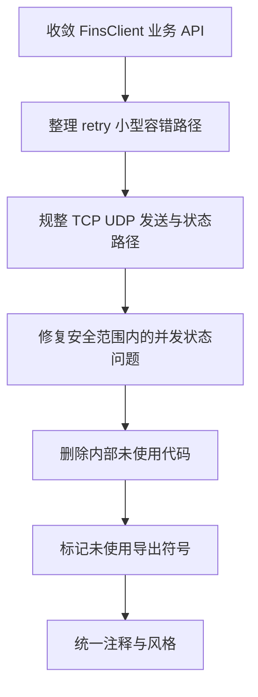

# 最终代码规整计划

> 范围：仅处理主库源码，排除 [`examples/`](../examples/)。
> 原则：以安全规整为主，不做破坏性导出 API 删除；对未使用但已导出的符号仅标记并在计划中列出。

## 目标

本轮规整聚焦四类问题：

1. 简化复杂实现，降低阅读和维护成本
2. 提升核心路径可读性，减少重复逻辑与分支噪音
3. 移除内部未使用代码与冗余实现
4. 对未使用的导出符号做显式标记，暂不破坏兼容性

## 执行顺序与每步优化说明

### 步骤 1：先收敛统一业务 API 的重复逻辑

**优化说明**

当前 [`FinsClient`](../client.go:17) 已经承担统一业务 API，但其内部仍有一些可继续抽取的公共逻辑，例如地址解析后读写、响应长度检查、字节与 word 编解码路径。这一层如果先规整，后续对传输层和容错层的改动会更稳定。

**计划动作**

- 保持 [`FinsClient`](../client.go:17) 作为统一业务 API 入口
- 抽取可复用的内部 helper，减少 [`ReadWord()`](../client.go:108)、[`ReadWords()`](../client.go:127)、[`WriteWord()`](../client.go:149)、[`WriteWords()`](../client.go:159)、[`ReadBytes()`](../client.go:170)、[`WriteBytes()`](../client.go:181)、[`ReadBit()`](../client.go:192)、[`WriteBit()`](../client.go:201) 之间的重复结构
- 统一参数校验与错误格式，避免同类逻辑分散在多个方法中

**预期收益**

- 减少样板代码
- 统一边界行为
- 后续新增 API 时更容易沿用既有模式

---

### 步骤 2：清理容错层中的职责混杂与粗糙实现

**优化说明**

[`retry.go`](../retry.go) 的整体规模不大，但应先把低风险且收益明确的点清理掉，例如错误链判定、策略克隆、重试延迟表达方式等。此步骤以小步整理为主，不在本轮引入大规模架构迁移。

**计划动作**

- 保持 [`RetryPolicy`](../retry.go:10) 对外结构稳定
- 继续使用 [`errors.Is()`](../retry.go:66) 作为错误链匹配的统一方式
- 检查 [`DoWithRetry()`](../retry.go:99) 中的循环与延迟逻辑，尽量让重试次数和等待顺序表达更直接
- 若存在仅为辅助而增加阅读负担的局部判断，可合并为更清晰的执行路径

**预期收益**

- 降低 retry 路径的理解成本
- 保留兼容性的同时让错误处理更可靠

---

### 步骤 3：重点规整 TCP 与 UDP 客户端中的复杂路径

**优化说明**

[`udp_client.go`](../udp_client.go) 与 [`tcp_client.go`](../tcp_client.go) 是本轮规整重点。两者承担连接管理、请求发送、响应匹配、状态维护与统计更新，复杂度最高，也是最容易藏冗余与烂代码的位置。本轮不追求抽成全新基座，但会优先做局部收敛和明确分层。

**计划动作**

- 对 [`FinsUDPClient.SendRequest()`](../udp_client.go:123) 和 [`FinsTCPClient.SendRequest()`](../tcp_client.go:499) 进行路径拆分
- 将连接检查、pending 注册、响应等待、统计更新等逻辑切成更清晰的内部步骤
- 消除难读的长函数内嵌分支，优先提炼私有 helper
- 对相同语义的状态更新与清理逻辑统一写法
- 检查锁的持有边界，尽量减少锁内做无关工作

**预期收益**

- 发送路径更容易阅读和排障
- 并发相关代码更容易验证正确性
- TCP 与 UDP 的差异点会更清晰

---

### 步骤 4：修复可安全处理的并发与状态管理问题

**优化说明**

本轮规整不是纯样式清理，还会顺手处理已经识别出的明显实现问题，因为这些问题与代码可读性和维护性直接相关。尤其是状态字段和统计字段，如果读写边界不统一，会让代码既难懂也不可靠。

**计划动作**

- 统一 [`ConnectionStats`](../types.go:165) 相关字段的更新方式，避免分散写入造成理解负担和潜在竞态
- 检查 [`GetConnectionStatus()`](../udp_client.go:243)、[`GetConnectionStatus()`](../tcp_client.go:136) 与发送路径中的状态读写是否一致
- 若发现 close 或重连相关流程存在幂等性风险，则优先改成可重复调用的安全实现
- 保证状态更新与资源释放的顺序清晰可追踪

**预期收益**

- 降低状态错乱和竞态风险
- 提升连接生命周期代码的稳定性

---

### 步骤 5：移除内部未使用方法与冗余代码

**优化说明**

用户要求移除未使用方法，但边界已经确认：仅做安全规整，避免破坏外部兼容性。因此，本步骤只删除主库内确认为内部冗余、且不会影响导出 API 的内容。

**计划动作**

- 全量排查主库内未使用的私有方法、私有辅助函数、无效字段、重复判断分支
- 删除内部未使用实现
- 删除重复包装、无效中转、死代码分支
- 保留“当前未使用但有注释说明的常量和类型”这一类项目，不作为本轮删除对象

**当前已知需重点核查项**

- [`currentSID`](../udp_client.go:16)
- [`currentSID`](../tcp_client.go:30)
- [`ParseTCPResponse()`](../tcp_frame.go:112) 是否仍存在且未被使用
- 仅服务于旧实现、现在已无调用的私有辅助函数

**预期收益**

- 降低噪音代码比例
- 让真实生效路径更聚焦

---

### 步骤 6：对未使用的导出符号做保守处理

**优化说明**

由于不能破坏对外兼容性，导出符号即使在仓库内暂未使用，也不应直接删除。本步骤只做标记、整理和说明，必要时补充注释，避免误导后续维护者。

**计划动作**

- 列出仓库内暂未使用的导出符号
- 区分“可能是对外 API”“可能是历史遗留”“明确保留的常量或类型”三类
- 不直接删除这些导出符号，但在代码规整结果中说明保留原因

**当前已知需保守处理的候选项**

- [`ErrInvalidSID`](../types.go:16)
- [`ErrInvalidDataLength`](../types.go:18)
- [`RetryCount`](../types.go:62)
- [`MemoryAddress`](../types.go:140)
- [`ICFNoResponse`](../constants.go:32)
- [`BroadcastAddr`](../constants.go:84)
- [`EthernetPort`](../constants.go:86)
- [`CmdParameterRead`](../constants.go:41)
- [`CmdParameterWrite`](../constants.go:42)
- [`CmdControllerOp`](../constants.go:43)
- [`MemAreaTC`](../constants.go:51) 与相关名称映射

**预期收益**

- 保留外部兼容性
- 为后续版本做 API 清理提供明确清单

---

### 步骤 7：统一代码风格与注释表达

**优化说明**

在核心逻辑收敛后，再做风格统一最合适。否则提前做注释或格式优化，后面仍会被结构性修改打断。

**计划动作**

- 统一关键方法注释风格
- 简化重复注释和过度解释的注释
- 让 helper 命名、错误消息、状态命名保持一致
- 对复杂路径仅保留必要注释，避免注释替代代码表达

**预期收益**

- 提升整体阅读流畅度
- 让代码本身承担更多表达职责

## 建议执行清单

## 本轮不做的事情

- 不修改 [`examples/`](../examples/) 目录
- 不进行破坏性导出 API 删除
- 不做大规模架构重写，例如一次性抽出完整共享基座
- 不为了追求绝对抽象而引入额外层级

## 实际执行结果

### 已完成的代码规整

1. 统一业务 API 收敛
   - 在 [`FinsClient`](../client.go:17) 内收敛地址解析与 word/byte 解码辅助逻辑
   - 为 [`ReadWords()`](../client.go:146)、[`WriteWords()`](../client.go:174)、[`ReadBytes()`](../client.go:189)、[`WriteBytes()`](../client.go:204) 增加明确边界校验
   - 将重复的解码与补齐逻辑下沉到私有 helper，减少样板代码

2. 重试路径简化
   - 在 [`retry.go`](../retry.go:9) 中集中默认退避参数
   - 简化 [`DoWithRetry()`](../retry.go:105) 的控制流，使“不可重试”“达到最大重试次数”分支更直观

3. UDP/TCP 发送路径拆分
   - 将 [`FinsUDPClient.SendRequest()`](../udp_client.go:138) 拆为准备请求、发送失败处理、等待响应、接收投递等私有步骤
   - 将 [`FinsTCPClient.sendRequestOnce()`](../tcp_client.go:422) 拆为准备请求、发送失败处理、等待响应、响应解析与投递等私有步骤
   - 接收循环从“大而全”的长函数改为主流程 + helper 的组合，降低嵌套深度

4. 安全范围内的并发与状态修复
   - 修复 [`FinsUDPClient.Close()`](../udp_client.go:77) 关闭 pending 响应通道后仍可能投递响应的风险
   - 统一 UDP 侧关闭通知与 pending 清理语义，避免关闭路径与读错误路径行为分散

### 构建验证

- 已执行 [`go build ./...`](../go.mod) 并通过，说明本轮调整后主库与示例均可正常编译

## 保守保留的未使用导出项

以下符号在仓库内当前未见实际使用，但因属于导出 API、常量或兼容性候选项，本轮仅记录，不做破坏性删除：

- [`ErrInvalidSID`](../types.go:16)
- [`ErrInvalidDataLength`](../types.go:18)
- [`RetryCount`](../types.go:62)
- [`MemoryAddress`](../types.go:140)
- [`ICFNoResponse`](../constants.go:32)
- [`BroadcastAddr`](../constants.go:84)
- [`EthernetPort`](../constants.go:86)
- [`CmdParameterRead`](../constants.go:41)
- [`CmdParameterWrite`](../constants.go:42)
- [`CmdControllerOp`](../constants.go:43)
- [`MemAreaTC`](../constants.go:51) 与 [`MemoryAreaNames`](../constants.go:132) 中对应条目
- [`SetConnectionStatus()`](../udp_client.go:269) 目前在仓库内未见调用，因其为导出方法，本轮保留

## 本轮已处理的内部冗余说明

- 已确认报告中的 `currentSID` 冗余项在当前代码基线中已不存在，现使用 [`sequenceNo`](../udp_client.go:15) / [`sequenceNo`](../tcp_client.go:87) 统一承担 SID 递增职责
- 旧版字符串匹配辅助函数 `contains` / `findSubstring` 在当前代码基线中已不存在，无需额外删除
- 未新增破坏性 API 变更，规整以私有 helper 收敛与行为安全修复为主

## 后续可继续推进但本轮未做的事项

- 若后续允许 API 清理，可再评估未使用导出符号的正式废弃与移除节奏
- 若后续要继续优化，可考虑进一步抽取 TCP/UDP 共享的 pending 注册、SID 分配与等待响应基座
- 若后续引入并发统计能力，应重新设计统计字段的加锁或原子更新策略
