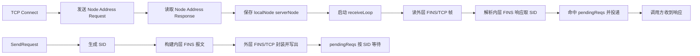

# FINS/TCP 重构方案（替换旧自定义 TCP 协议）

目标：TCP 传输改为欧姆龙官方 FINS/TCP 封装（外层 16B 头 + 内层标准 FINS 报文），并让并发/匹配机制与 UDP 保持一致；不保留旧的自定义 20B 头格式。

相关现状定位：当前实现把 `LocalNode/ServerNode` 写入自定义 TCP 头 `ClientNode/ServerNode`（见 [`NewTCPRequestFrame()`](../tcp_frame.go:89)、[`type FinsTCPFrame`](../types.go:69)），且响应通过共享 `responseCh` 取下一条导致并发错配（见 [`FinsTCPClient.responseCh`](../tcp_client.go:19)、[`(*FinsTCPClient).SendRequest()`](../tcp_client.go:85)）。

---

## 1. 新的帧模型

### 1.1 外层 FINS/TCP 头（官方）

外层固定 16 字节：

- Magic: 4B 固定 ASCII FINS
- Length: 4B，表示后续字节数（从 Command 开始到数据结束）
- Command: 4B
- ErrorCode: 4B
- Data: 可变长

> 关键点：Length 不再是总帧长。读取逻辑应为：先读 Magic+Length 共 8B，再读 Length 指定的剩余字节（其中前 8B 是 Command+ErrorCode）。

建议常量（需在实现时确认 PLC 兼容）：

- CommandNodeAddressRequest = 0x00000000
- CommandNodeAddressResponse = 0x00000001
- CommandFinsCommand = 0x00000002
- CommandFinsResponse = 0x00000003

### 1.2 内层 FINS 报文（与 UDP 复用）

TCP 的 Data 携带完整 FINS 报文：

- 10B FINS header（ICF/RSV/GCT/DNA/DA1/DA2/SNA/SA1/SA2/SID）
- 2B Command（如 0x0101 读）
- N bytes 参数

内层的构建/解析应尽量复用现有 UDP 编解码（见 [`BuildUDPFrame()`](../udp_frame.go:10)、[`ParseUDPResponse()`](../udp_frame.go:88)）。实现时可考虑把命名从 UDPFrame 抽象为 FINSFrame（保持对外 API 不变）。

---

## 2. TCP 握手（始终执行）

策略：`Connect()` 建立 TCP socket 后，立即发送 Node Address Request；解析响应得到本地/远端节点号并写入 TCP 客户端实例；若 PLC 返回 0，则回退使用 config 里的 `LocalNode/ServerNode`。

建议流程（在 [`(*FinsTCPClient).Connect()`](../tcp_client.go:38) 内）：

1. Dial 成功
2. 发送 Node Address Request（外层头 + payload）
3. 同步读取 Node Address Response（避免与 receiveLoop 竞争）
4. 保存 localNode/serverNode
5. 启动 `receiveLoop`

> 注：config 中的 `LocalNode/ServerNode` 对 TCP 将变为回退值；对 UDP 仍照旧写入 `SA1/DA1`（见 [`NewUDPRequestFrame()`](../udp_frame.go:69)）。

---

## 3. TCP 请求-响应匹配（与 UDP 一致）

目标：像 UDP 一样用 SID 进行 pending 映射，消除共享 `responseCh` 的并发错配。

改造点：

- 在 [`type FinsTCPClient`](../tcp_client.go:12) 增加：
  - `sequenceNo uint16`、`currentSID byte`、`pendingReqs map[byte]*PendingRequest`
  - `getNextSID()` 逻辑直接对齐 [`(*FinsUDPClient).getNextSID()`](../udp_client.go:101)
- 在 [`(*FinsTCPClient).SendRequest()`](../tcp_client.go:85)
  - 生成 SID
  - 构造内层 FINS 报文（10B+2B+data）
  - 外层封装为 FINS/TCP CommandFinsCommand
  - 把 `PendingRequest{SID, Response chan}` 挂入 `pendingReqs`
  - 等待 `req.Response` 或超时/关闭

### receiveLoop

在 [`(*FinsTCPClient).receiveLoop()`](../tcp_client.go:136)：

1. 读取外层 FINS/TCP 完整帧（按 magic+length）
2. 校验外层 Command 必须为 FinsResponse
3. 解析外层 Data 为内层 FINS 响应：复用 [`ParseUDPResponse()`](../udp_frame.go:88) 取到 SID + StatusCode
4. `pendingReqs[SID]` 命中则投递并删除

---

## 4. 代码与文档变更清单（实现阶段）

- 类型/常量：
  - 重写 [`type FinsTCPFrame`](../types.go:69) 字段以匹配外层官方头
  - 新增 TCP Command 常量到 [`constants.go`](../constants.go:10)
- 编解码：
  - 重写 [`BuildTCPFrame()`](../tcp_frame.go:10)、[`ParseTCPFrame()`](../tcp_frame.go:50)、[`ReadTCPFrameFromConn()`](../tcp_frame.go:135)
- TCP 客户端：
  - 在 [`(*FinsTCPClient).Connect()`](../tcp_client.go:38) 增加握手
  - 重写 [`(*FinsTCPClient).SendRequest()`](../tcp_client.go:85) 与 [`(*FinsTCPClient).receiveLoop()`](../tcp_client.go:136) 的匹配逻辑
  - 删除/废弃共享 `responseCh`
- 文档：
  - 修订 [`docs/PROJECT_INTRO.md`](../docs/PROJECT_INTRO.md:55) 与 [`docs/FINS_PROTOCOL_SPEC.md`](../docs/FINS_PROTOCOL_SPEC.md:31) 中 TCP 帧头描述（去除旧自定义头）
- 示例/测试：
  - 更新 [`examples/tcp/tcp_example.go`](../examples/tcp/tcp_example.go:1)
  - 更新/新增测试：[`frame_test.go`](../frame_test.go:78)

---

## 5. Mermaid 流程图

